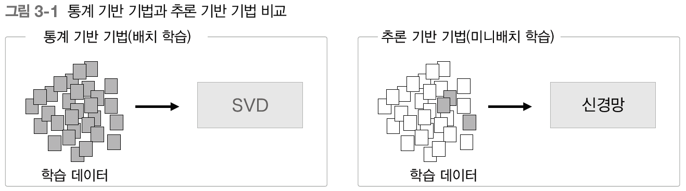

# 밑시딥2 📂3. word2vec

> 앞장에서는 '통계 기반 기법'으로 단어의 분산 표현을 얻었다.
>
> 이번 장에서는 더 강력한 기법인 '추론 기반 기법'을 살펴보자.


## 1. 추론 기반 기법과 신경망

> 단어를 벡터 표현하는 방법인 '통계 기반 기법'과 '추론 기반 기법'은 단어의 의미를 얻는 방식은 다르지만 바탕은 '분포 가설'이다.
>
> 이번 절에서는 통계 기반 기법의 문제점을 알아보고 그 대안인 추론 기반 기법의 이점을 알아보자.


### 1.1 통계 기반 기법의 문제점

통계 기반 기법은 주변 단어의 빈도를 기초로 단어를 표현하는 기법이다.

즉, 단어의 동시발생 행렬을 만들고 그 행렬에 SVD를 적용하여 밀집벡터를 얻는다.

말뭉치의 어휘 수는 어마어마하기때문에 이런 거대 행렬에 SVD를 적용하는 일은 어렵다.

🔥 말뭉치 전체의 통계를 이용해 <u>단 1회의 처리(배치 학습)</u>를 통해 단어의 분산 표현을 얻는다. 




하지만 신경망을 이용하는 추론 기반 기법은 미니배치로 학습하기 때문에 위 문제점의 해결책이 된다.


### 1.2 추론 기밥 기법 개요

추론 기반 기법은 주변 단어들을 맥락으로 사용해서 특정 단어를 추측한다.

 

> 추론 문제를 반복해서 풀면서 단어의 출현 패턴을 학습하는 것

 

이 모델로 신경망을 사용한다.

모델은 맥락 정보를 입력받아서 각 단어의 출현 확률을 출력한다.

틀 안에서 말뭉치 사용해 모델이 올바른 추측을 출력하도록 학습시키며 그 학습의 결과로 단어의 분산 표현을 얻는다.


### 1.3 신경망에서의 단어 처리

신경망은 단어를 그대로 처리할 수 없기때문에 <u>'고정 길이의 벡터'</u>로 변환해야한다.

이때 사용하는 방법이 **`원핫표현(원핫벡터)`**이다.

 

> 총 어휘 수만큼의 원소를 갖는 벡터를 준비하고, 인덱스가 단어id와 같은 원소를 1로, 나머지는 0으로 설정

단어를 고정 길이 벡터로 변환하면 신경망의 입력층은 뉴런의 수를 고정할 수 있다.


 

 

> 가중치 존재, 입력층 뉴런과의 가중합이 은닉층 뉴런이 된다.

```python
c = np.array([[1,0,0,0,0,0,0]]) # 입력층
W = np.random.randn(7, 3)
h = np.matmul(c, W)
```

 

```python
class MatMul:
    def __init__(self, W):
        self.params = [W]
        self.grads = [np.zeros_like(W)]
        self.x = None

    # 순전파
    def forward(self, x):
        W, = self.params
        out = np.dot(x, W)
        self.x = x
        return out

    def backward(self, dout):
        W, = self.params
        dx = np.dot(dout, W.T)
        dW = np.dot(self.x.T, dout)
        self.grads[0][...] = dW
        return dx
```

```python
c = np.array([[1,0,0,0,0,0,0]]) # 입력층
W = np.random.randn(7, 3)
layer = MatMul(W)
h = layer.forward(c)
```


----


## 2. 단순한 word2vec

> 여기서는 맥락을 토대로 각 단어들을 확률분포로 나타내는 모델을 신경망으로 구축하자.
>
> 이번 절에서 사용할 신경망은 CBOW(continuous bag-of-words) 모델이다.


### 2.1 CBOW 모델의 추론 처리

> CBOW : 맥락으로부터 target(중앙 단어)을 추측하는 용도의 신경망

CBOW 모델의 입력은 맥락이다.

이 맥락을 원핫 표현으로 변환하여 CBOW 모델이 처리할 수 있도록 한다.


CBOW 모델의 신경망 구조는 아래와 같다.

 

- 입력층이 2개이고 두 입력층에서 은닉층으로의 변환은 완전연결계층이 처리한다.

  🙄 맥락으로 고려할 단어를 2개로 정했기 때문에 입력층 2개임.

  ​	  맥락에 포함시킬 단어가 N개라면 입력층도 N개이다.

  그리고 은닉층에서 출력층 뉴런으로의 변환은 다른 완전연결계층이 처리한다.

- 🔥 입력층 : 맥락, 출력층 : 입력인 맥락을 토대로 타겟(중앙단어)을 예측, 가중치 : 분산표현

- 은닉층의 뉴런은 입력층의 완전연결계층에 의해 변환된 값인데, 입력층이 여러 개이면 전체를 '평균'하면됨.

  즉, 0.5*(h1+h2) = 은닉층 뉴런 으로 계산

- 출력층의 뉴런 하나하나가 각각의 단어에 대응한다. 출력층의 뉴런은 각 단어의 '점수'를 뜻함.

  따라서 점수가 높을수록 입력층의 맥락에 대한 출현 활률이 높아짐.


- 위에서 가중치를 살펴보자.

  📍 가중치 W_in : 7X3 행렬. **`단어의 분산 표현`** (행 기준)

  📍 가중치 W_out : 3X7 행렬. **`단어의 분산 표현`** (열 기준)


🔥 은닉층의 뉴런 수를 입력층의 뉴런 수보다 적게 하는 것이 핵심!

​	왜?? => 단어 예측에 필요한 정보를 '간결하게' 담게되며 밀집벡터 표현을 얻을 수 있기 때문

​	이때 은닉층의 정보는 인코딩에 해당되며 은닉층의 정보로부터 원하는 결과를 얻는 작업을 **`디코딩`**이라고 한다.


- 아래는 뉴런관점에서 봤던 CBOW를 계층 관점에서 그린 것이다.

   

  ```python
  # 위의 CBOW 모델의 신경망 구현
  # 샘플 맥락 데이터
c0 = np.array([[1, 0, 0, 0, 0, 0, 0]])
  c1 = np.array([[0, 0, 1, 0, 0, 0, 0]])
  
  # 가중치 초기화
  W_in = np.random.randn(7, 3)
  W_out = np.random.randn(3, 7)
  
  # 계층 생성
  in_layer0 = MatMul(W_in)
  in_layer1 = MatMul(W_in)
  out_layer = MatMul(W_out)
  
  # 순전파
  h0 = in_layer0.forward(c0)
  h1 = in_layer1.forward(c1)
  h = 0.5 * (h0 + h1)
  s = out_layer.forward(h)
  print(s)
  # [[-0.37141207 -1.81020442 -0.15594498  0.03679914  0.34819764  0.18324066 -0.62315239]]
  ```
  
  
  
  

### 2.2 CBOW 모델의 학습

지금까지 CBOW 모델은 출력층의 각 단어의 점수를 출력했다. 이 점수에 소프트맥스 함수를 적용하면 `확률`을 얻을 수 있다. 

📍 이 확률은 맥락이 주어졌을 때 그 중앙에 어떤 단어가 출현하는지 나타낸다.

때문에 올바른 예측을 할 수 있도록 가중치를 조정하는 일을 학습이라고 한다.


🔥 가중치 W_in, W_out : 단어의 출현 패턴을 파악하는 벡터가 학습됨


소프트맥스 계층과 교차엔프로피 계층을 사용하여 LOSS를 구할 수 있음

 


### 2.3 word2vec의 가중치와 분산 표현

📍 가중치 W_in : 각 행이 각 단어의 분산 표현

📍 가중치 W_out : 단어의 의미가 인코딩된 벡터 저장


최종적으로 이용하는 단어의 분산 표현은 무엇일까?

세가지의 방법이 있다.

1. 입력측의 가중치만 이용
2. 출력측의 가중치만 이용
3. 둘다 이용


word2vec에서는 1번 선택.

우리도 이를 따라서 W_in을 단어의 분산 표현으로 이용하자.


---


## 3. 학습 데이터 준비

> word2vec 학습에 쓰일 학습 데이터를 준비하자.


### 3.1 맥락과 타깃

 우리의 목표는 신경망에 '맥락'을 입력했을 때 '타깃'이 출현할 확률을 높이는 것이다.

그럼 말뭉치에서 '맥락'과 '타깃'을 만드는 작업을 생각해야한다.

 

🔥 목표로 하는 단어 : 타깃 / 그 주변 단어 : 맥락

맥락의 각 행은 입력으로 쓰이고 타깃의 각 행은 정답 레이블이 된다.


말뭉치로부터 맥락과 타깃을 만드는 함수를 구현해야한다. 우선 말뭉치 덱스트를 단어 id로 변환하는 방법부터 살펴보자.

```python
# preprocess() 함수
def preprocess(text):
    text = text.lower()
    text = text.replace('.', ' .')
    words = text.split(' ')

    word_to_id = {}
    id_to_word = {}
    for word in words:
        if word not in word_to_id:
            new_id = len(word_to_id)
            word_to_id[word] = new_id
            id_to_word[new_id] = word

    corpus = np.array([word_to_id[w] for w in words])

    return corpus, word_to_id, id_to_word


text = 'You say goodbye and I say hello.'
corpus, word_to_id, id_to_word = preprocess(text)

print(corpus)
# [0 1 2 3 4 1 5 6]

print(id_to_word)
# {0: 'you', 1: 'say', 2: 'goodbye', 3: 'and', 4: 'i', 5: 'hello', 6: '.'}
```


위에서 구한 corpus를 이용하여 맥락과 타깃을 만들수 있다.

 

```python
# 맥락과 타깃 생성
def create_contexts_target(corpus, window_size=1):
    '''
    :param corpus: 말뭉치(단어 ID 목록)
    :param window_size: 윈도우 크기(윈도우 크기가 1이면 타깃 단어 좌우 한 단어씩이 맥락에 포함)
    '''
    target = corpus[window_size:-window_size] # 양 끝 단어 제외
    contexts = []

    for idx in range(window_size, len(corpus)-window_size): # 양 끝 단어 제외(target dix 순회)
        cs = []
        for t in range(-window_size, window_size + 1): # window_size 만큼 왼쪽, 오른쪽 순회
            if t == 0:
                continue
            cs.append(corpus[idx + t]) # target 중심에서 왼쪽, 오른쪽 순회
        contexts.append(cs)

    return np.array(contexts), np.array(target)
```

이 맥락과 타깃의 각 워소는 여전히 단어 id이다. 따라서 원핫 표현으로 변환해야한다.


### 3.2 원핫 표현으로 변환

 

여기서 주목해야할 것은 다차원 배열의 형상이다.

단어id를 이용했을 때의 맥락의 형상은 (6,2)인데, 원핫표현은 (6,2,7)이 된다.

이는 convert_one_hot() 함수를 사용하면 쉽게 변환가능하다.

```python
# 원핫 표현으로 변환
def convert_one_hot(corpus, vocab_size):
    '''
    :param corpus: 단어 ID 목록(1차원 또는 2차원 넘파이 배열)
    :param vocab_size: 어휘 수
    :return: 원핫 표현(2차원 또는 3차원 넘파이 배열)
    '''
    N = corpus.shape[0]

    if corpus.ndim == 1: # 1차원 일때, 2차원으로 변환 (tartget일 경우)
        one_hot = np.zeros((N, vocab_size), dtype=np.int32) # 0으로 초기화
        for idx, word_id in enumerate(corpus):
            one_hot[idx, word_id] = 1

    elif corpus.ndim == 2: # 2차원 일때, 3차원으로 변환 (맥락일 경우)
        C = corpus.shape[1]
        one_hot = np.zeros((N, C, vocab_size), dtype=np.int32)
        for idx_0, word_ids in enumerate(corpus):
            for idx_1, word_id in enumerate(word_ids):
                one_hot[idx_0, idx_1, word_id] = 1

    return one_hot
```


---


## 4. CBOW 모델 구현

> CBOW 모델을 구현해보자.

```python
class SimpleCBOW:
    def __init__(self, vocab_size, hidden_size):
        # vocab_size : 어휘 수
        # hidden_size : 은닉층의 뉴런 수
        V, H = vocab_size, hidden_size

        # 가중치 초기화(작은 무작위 값으로)
        W_in = 0.01 * np.random.randn(V, H).astype('f') # 32비트 부동소수점 수로 초기화
        W_out = 0.01 * np.random.randn(H, V).astype('f')

        # 계층 생성
        self.in_layer0 = MatMul(W_in)
        self.in_layer1 = MatMul(W_in)
        self.out_layer = MatMul(W_out)
        self.loss_layer = SoftmaxWithLoss()

        # 모든 가중치와 기울기를 리스트에 모은다.
        layers = [self.in_layer0, self.in_layer1, self.out_layer]
        self.params, self.grads = [], []
        for layer in layers:
            self.params += layer.params
            self.grads += layer.grads

        # 인스턴스 변수에 단어의 분산 표현을 저장한다.
        self.word_vecs = W_in

    def forward(self, contexts, target):
        h0 = self.in_layer0.forward(contexts[:, 0]) # 미니배치의 수
        h1 = self.in_layer1.forward(contexts[:, 1]) # 맥락의 윈도우 크기
        h = (h0 + h1) * 0.5
        score = self.out_layer.forward(h)
        loss = self.loss_layer.forward(score, target)
        return loss
```


- 역전파

 


```python
def backward(self, dout=1):
        ds = self.loss_layer.backward(dout)
        da = self.out_layer.backward(ds)
        da *= 0.5 # 중간에 0.5를 곱하기때문에
        self.in_layer1.backward(da)
        self.in_layer0.backward(da)
        return None
```


### 4.1 학습 코드 구현

> CBOW 모델의 학습은 일반적인 신경망의 학습과 같다.
>
> 학습 데이터를 준비해 신경망에 입력하고 기울기를 구하고 가중치를 순서대로 갱신한다.

```python
window_size = 1
hidden_size = 5
batch_size = 3
max_epoch = 1000

text = 'You say goodbye and I say hello.'
corpus, word_to_id, id_to_word = preprocess(text)

vocab_size = len(word_to_id)
contexts, target = create_contexts_target(corpus, window_size)
target = convert_one_hot(target, vocab_size)
contexts = convert_one_hot(contexts, vocab_size)

model = SimpleCBOW(vocab_size, hidden_size)
optimizer = Adam() # 최적화 : Adam
trainer = Trainer(model, optimizer)

trainer.fit(contexts, target, max_epoch, batch_size)
trainer.plot()

word_vecs = model.word_vecs
for word_id, word in id_to_word.items():
    print(word, word_vecs[word_id])

```

 

> 현시점의 CBOW모델 구현은 처리 효율 면에서 몇 가지 문제가 있다. 


---


## 5. word2vec 보충

> CBOW 모델을 '확률' 관점에서 다시 살펴보자.


### 5.1 CBOW 모델과 확률

확률 : P()

동시확률 : P(A , B)

사후확률 : P(A|B) => B라는 정보가 주어졌을 때 A가 일어날 확률


- CBOW 모델은 맥락을 주면 타깃 단어가 출현할 확률을 출력한다. 

 

🙄 W_t-1과 W_t+1이 주어질 때 W_t가 될 확률?

​	


교차 엔트로피 오차에 확률을 적용시키면 아래와 같이 된다.

  = 음의 로그 가능도(negative log likelihood)

말뭉치 전체로 확장하면 다음 식이 된다.

 


### 5.2 skip-gram 모델

> CBOW에서 다루는 맥락과 타깃을 역전시킨 모델

 

skip-gram 모델은 중앙의 단어(타깃)으로부터 주변의 여러 단어(맥락)를 추측한다.

 

 

입력층은 하나이다. 출력증은 맥락의 수만큼 존재한다. 

즉, 출력층에서는 개별적으로 손실을 구하고, 이 개별 손실을 모두 더한 값을 최종 손실로 한다.

skip-gram 모델을 확률로 표기하면 아래와 같다.

 

만약 단어들 사이에 관련성이 없다고 가정하면 다음과 같은 조건부 독립이 가능하다.

 

위의 식을 엔트로피 오차에 적용하면 손실함수를 유도할 수 있다.

 

말뭉치 전체로 확장하면 다음 식이 된다.

 

🔥 skip-gram 모델은 맥락의 수만큼 추측하므로 손실 함수는 각 맥락에서 구한 손실의 총합이어야하지만, CBOW 모델은 타깃 하나의 손실을 구한다.


그렇다면 CBOW vs `skip-gram`??

`skip-gram` => 단어 분산 표현의 정밀도 면에서 더 결과가 좋기 때문에

- skip-gram 구현

  ```python
  class SimpleSkipGram:
      def __init__(self, vocab_size, hidden_size):
          V, H = vocab_size, hidden_size
  
          # 가중치 초기화
          W_in = 0.01 * np.random.randn(V, H).astype('f')
          W_out = 0.01 * np.random.randn(H, V).astype('f')
  
          # 계층 생성
          self.in_layer = MatMul(W_in)
          self.out_layer = MatMul(W_out)
          self.loss_layer1 = SoftmaxWithLoss() # 두개의 맥락을 출력할 것이므로
          self.loss_layer2 = SoftmaxWithLoss()
  
          # 모든 가중치와 기울기를 리스트에 모은다.
          layers = [self.in_layer, self.out_layer]
          self.params, self.grads = [], []
          for layer in layers:
              self.params += layer.params
              self.grads += layer.grads
  
          # 인스턴스 변수에 단어의 분산 표현을 저장한다.
          self.word_vecs = W_in
  
      def forward(self, contexts, target):
          h = self.in_layer.forward(target)
          s = self.out_layer.forward(h)
          l1 = self.loss_layer1.forward(s, contexts[:, 0])
          l2 = self.loss_layer2.forward(s, contexts[:, 1])
          loss = l1 + l2 # 각 손실을 더한다.
          return loss
  
      def backward(self, dout=1):
          dl1 = self.loss_layer1.backward(dout)
          dl2 = self.loss_layer2.backward(dout)
          ds = dl1 + dl2 # 더하기는 그냥 더하기
          dh = self.out_layer.backward(ds)
          self.in_layer.backward(dh)
          return None
  
  ```

  

### 5.3 통계 기반 vs 추론 기반

|                   | 통계 기반                         | 추론 기반                             |
| ----------------- | --------------------------------- | :------------------------------------ |
| 학습 방법         | 말뭉치의 전체 통계로부터 1회 학습 | 말뭉치를 일부분씩 여러 번 보면서 학습 |
| 분산 표현 갱신 시 | 계산을 처음부터 다시 시작         | 매개변수만 다시 학습                  |
| 분산 표현의 성격  | 단어의 유사성 인코딩              | 단어의 유사성+단어 사이의 패턴        |
| 정확도            | 비슷                              | 비슷                                  |

> 두 세계는 연결되어 있다.  두 기법 융합한 GloVE 기법이 등장했다. 이는 말뭉치 전체의 통계 정보를 손실 함수에 도입해 미니배치 학습을 하는 것이다.