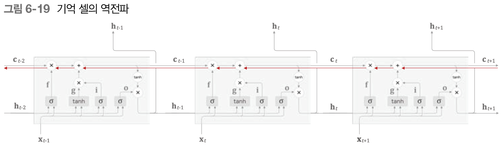

# 밑시딥2 📂6.게이트가 추가된 RNN

> 앞장에서 학습한 RNN은 과거의 정보를 기억할 수 있었다.
>
> 하지만 장기 의존 관계를 잘 학습할 수 없어 성능이 좋지 못하다.
>
> 이 문제를 해결하기 위해 gate가 추가된 LSTM과 GRU로 시계열 데이터의 장기 의존 관계를 학습할 수 있다.
>
> 이번장에서는 LSTM(Long Short-Term Memory)과 GRU를 알아보고 장기기억을 가능하게 하는 메커니즘을 이해해보자.

* LSTM(Long Short-Term Memory) : 단기 기억을 장시간 기억


## 1. RNN의 문제점

🙄 RNN 문제점 : <u>장기 의존 관계</u>를 학습하기 어렵다.

​	👉 이유 : BPTT에서 **`기울기 소실`** 혹은 **`기울기 폭발`**이 일어나기 때문

- 기울기 소실(Vanishing Gradient) : 역전파의 기울기 값이 점점 작아지다가 사라지는 현상
- 기울기 폭발(Exploding Gradient) : 역전파의 기울기 값이 점점 커져 발산하는 현상


### 1.1 RNN 복습

 

RNN 계층은 시계열 테이터인 x_t를 입력하면 h_t를 출력한다.

이 **`h_t`**를 은닉 상태라고 하며 <u>과거 정보를 저장</u>한다.


### 1.2 기울기 소실 또는 기울기 폭발

앞장의 RNN의 문제점을 생각해보자.


 

?에 들어갈 말을 찾기 위해서는 앞의 맥락을 기억하고 있어야한다.

즉, 맥락(정보)를 RNN계층의 은닉 상태에 인코딩해 보관해둬야한다는 뜻이다.

이 예제를 RNNLM 학습의 관점에서 생각해 기울기의 전파를 확인해보자.

 

정답 레이블 "TOM"이 주어진 시점으로부터 과거 방향으로 기울기를 전달하게 된다.

이때 학습에서 중요한 것은 RNN계층의 존재이다.

**RNN 계층이 과거 방향으로 <u>의미 있는 기울기</u>를 전달함으로써 시간 방향의 의존 관계를 학습할 수 있다.** (장기 의존 관계 학습 가능)

현재의 단순한 RNN 계층에서는 과거일수록 `기울기 소실`과 `기울기 폭발`의 가능성이있다.


### 1.3 기울기 소실과 기울기 폭발의 원인

그렇다면 기울기 소실과 기울기 폭발이 일어나는 원인은 무엇일까

우선 RNN 계층에서의 시간 방향 기울기 전파에만 주목해보자.

 

시간 방향 기울기는 'tanh', '+', 'MatMul' 연산을 통과한다. 이 중, tanh과 MatMul의 기울기를 확인해보자.

1️⃣ tanh

 

- 역전파에서 기울기가 tanh노드 지날 때마다 값을 계속 작아진다.


2️⃣ MatMul

 

- 똑같은 가중치인 W_h만 사용한다.
- 즉, 기울기의 크기는 시간에 비례해 지수적으로 증가(exploding gradients)하거나 감소(vanishing gradients)한다. 

파이썬으로 증명하면 아래와 같다.

```python
N = 2   # 미니배치 크기
H = 3   # 은닉 상태 벡터의 차원 수
T = 20  # 시계열 데이터의 길이

dh = np.ones((N, H))

np.random.seed(3) # 재현할 수 있도록 난수의 시드 고정

Wh = np.random.randn(H, H) # 기울기 폭발
#Wh = np.random.randn(H, H) * 0.5 # 기울기 소실

norm_list = []
for t in range(T):
    dh = np.dot(dh, Wh.T)
    norm = np.sqrt(np.sum(dh**2)) / N # 노름의 크기로 구한다
    norm_list.append(norm)
```

 

🔥 기울기 폭발의 경우, 오버플로를 일으켜 NaN(Not a Number)같은 값을 발생시킨다.

​	 기울기 손실의 경우, 가중치 매개변수가 더 이상 갱신되지 않는다.


이러한 지수적인 변화의 원인은?

👉 행렬을 곱했기 때문이다. 스칼라가 아닌 행렬의 경우 기울기의 크기는 **'특잇값'**을 확인하여 결정한다.

📍 특잇값 : 데이터가 얼마나 퍼져 있는지 나타내는 값

특잇값이 1보다 크면 지수적 증가, 작으면 지수적 감소 가능성이 크다.


### 1.4 기울기 폭발 대책

기울기 폭발과 손실의 해결책은 무엇인가

기울기 폭발의 전통적인 기법은 **`기울기 클리핑(gradients clipping)`**으로 기울기가 문턱값을 초과하면 기울기를 아래와 같이 수정.

 

이때 모든 매개변수에 대한 기울기를 하나로 처리한다고 가정한다.

이를 파이썬으로 구현해보자.

```python
dW1 = np.random.rand(3, 3) * 10
dW2 = np.random.rand(3, 3) * 10
grads = [dW1, dW2]
max_norm = 5.0

def clip_grads(grads, max_norm):
    total_norm = 0
    for grad in grads:
        total_norm += np.sum(grad ** 2)
    total_norm = np.sqrt(total_norm)

    rate = max_norm / (total_norm + 1e-6)
    if rate < 1:
        for grad in grads:
            grad *= rate
            
'''
before: [0.09254799 4.07546796 7.98555222 3.14706569 5.92990452 5.2274525
 5.80975993 1.98236163 7.44847141]
after: [0.02159634 0.95102225 1.86345173 0.73437689 1.38376039 1.21984117
 1.3557243  0.46258983 1.73812236]
'''
```


---


## 2. 기울기 소실과 LSTM

기울기 소실을 해결하기 위해서는 계층 구조를 변경해야한다. 

떄문에 나온 구조가 게이트가 추가된 RNN이다.

대표적인 예로 LSTM과 GRU가 있다. 이번절에서는 LSTM에 대해 자세히 알아보자.


### 2.1 LSTM의 인터페이스(입출력)

LSTM을 자세히 알아보기 전에 계산 그래프를 단순화하기 위해 행렬 계산 등을 하나의 직사각형 노드로 정리해 그리는 방식을 기억해두자.

 


먼저 LSTM과 RNN의 인터페이스(입출력)을 비교해보자.

 

차이점은 c라는 경로의 유무이다. 여기서 **`c는 기억 셀(memory cell)`**이며 LSTM의 전용 기억 메커니즘이다.

🔥 기억 셀의 특징 : 데이터를 자기 자신으로만 주고받는다는 것. LSTM계층 외의 다른 계층으로는 출력하지 않는다.


### 2.2 LSTM 계층 조립하기

  

기억 셀 c_t는 과거로부터 시각 t까지의 필요한 모든 정보가 저장돼 있다고 가정하자.

필요한 정보를 모두 간직한 이 기억을 바탕으로 h_t를 출력한다 => **`h_t = tanh(c_t)`**


게이트는 데이터의 흐름을 제어한다. 게이트의 열림 상태는 0.0~1.0(1.0은 완전 개방) 사이의 실수로 나타낸다.

🔥  게이트의 열림 정도도 데이터로부터 자동으로 학습한다.


### 2.3 output 게이트

이번절에서는 tanh(c_t)에 게이트를 적용하는 걸 생각해보자.

즉, tanh(c_t)가 다음 시각에서 얼마나 중요한가를 조정하기 위해 게이트를 적용한다.

이 게이트를 **`output게이트`**라고 한다.

output 게이트의 <u>열림 상태</u>는 입력 x_t와 h_t-1 로부터 구하며 식은 아래와 같다.

 

 

열림 상태 o와 tanh(c_t)의 원소 별 곱을 h_t로 출력한다. 여기서 원소 별 곱을 아다마르 곱(Hadamard product)이라고 한다.

기호로는 ⨀로 나타내며 h_t의 식은 아래와 같다.

 

*tanh는 -1~1의 실수이며 인코딩된 정보의 정도를 표시하며 

시그모이드 출력은 0~1의 실수이며 얼마만큼 통과시킬지 정한다.


### 2.4 forget 게이트

기억 셀에서 무엇을 잊을지 명확하게 지시하는 것은 성능을 더욱 향상시킨다.

때문에 c_t-1의 기억 중 <u>불필요한 것을 잊게해주는 게이트</u>를 **`forget 게이트`**라 한다.

 

 

forget 게이트의 식과 계산은 output 게이트와 유사하다.


### 2.5 새로운 기억 셀

이전 기억을 일부분 삭제하는 것에서 이제는 새로운 기억 정보를 추가해야한다.

아래와 같이 tanh노드를 추가해 새로운 정보를 기억 셀에 추가한다.

 

 


### 2.6 input 게이트

새로운 정보 또한 얼마나 중요한지를 판단하여 그만큼 추가해야한다. 때문에 input 게이트를 사용하여 새 정보의 양을 조절한다.

 

 


### 2.7 LSTM의 기울기 흐름

앞서 구현한 게이트들로 기울기 소실을 어떻게 해결할 수 있는가에 대해 알아보자.



기억 셀의 역전파에만 집중하면 역전파가 통과하는 노드는 '+', 'X' 밖에 없다.

'+'는 기울기 변화는 일어나지 않는다.

'X'노드는 아마다르 곱을 계산한다. 즉, 매 시각 <u>다른 게이트 값을 이용</u>해 원소별 곱을 계산하기 때문에

<u>곱셈의 효과가 누적되지 않아</u> 기울기 소실이 일어나지 않는다.


---


## 3. LSTM 구현

배운 게이트들을 적용하여 LSTM을 구현해보자.

편리를 위해 4개의 가중치를 하나로 모아 1회 계산으로 끝낼 수 있게 아래와 같이 변환한다.

 

위와 같이 행렬로 묶으면 계산 속도가 빨라져 성능이 향상된다.

 

```python
class LSTM:
    def __init__(self, Wx, Wh, b):
        '''
        Parameters
        ----------
        Wx: 입력 x에 대한 가중치 매개변수(4개분의 가중치가 담겨 있음)
        Wh: 은닉 상태 h에 대한 가장추 매개변수(4개분의 가중치가 담겨 있음)
        b: 편향（4개분의 편향이 담겨 있음）
        '''
        self.params = [Wx, Wh, b]
        self.grads = [np.zeros_like(Wx), np.zeros_like(Wh), np.zeros_like(b)]
        # 순전파 때 중간 결과를 보관했다가 역전파 계산에 사용
        self.cache = None 

    def forward(self, x, h_prev, c_prev):
        '''
        x : 현 시각 입력
        h_prev : 이전 시각의 은닉 상태
        c_prev : 이전 시각의 기억 셀
        '''
        
        Wx, Wh, b = self.params
        N, H = h_prev.shape
        # N : 미니배치 수, H : 기억셀과 은닉상태의 차원 수

        A = np.dot(x, Wx) + np.dot(h_prev, Wh) + b

        f = A[:, :H]
        g = A[:, H:2*H]
        i = A[:, 2*H:3*H]
        o = A[:, 3*H:]

        f = sigmoid(f)
        g = np.tanh(g)
        i = sigmoid(i)
        o = sigmoid(o)

        c_next = f * c_prev + g * i
        h_next = o * np.tanh(c_next)

        self.cache = (x, h_prev, c_prev, i, f, g, o, c_next)
        return h_next, c_next

    def backward(self, dh_next, dc_next):
        Wx, Wh, b = self.params
        x, h_prev, c_prev, i, f, g, o, c_next = self.cache

        tanh_c_next = np.tanh(c_next)

        ds = dc_next + (dh_next * o) * (1 - tanh_c_next ** 2)

        dc_prev = ds * f

        di = ds * g
        df = ds * c_prev
        do = dh_next * tanh_c_next
        dg = ds * i

        di *= i * (1 - i)
        df *= f * (1 - f)
        do *= o * (1 - o)
        dg *= (1 - g ** 2)

        # slice 노드의 역전파에서는 4개의 행렬을 연결하면 된다.
        dA = np.hstack((df, dg, di, do))

        dWh = np.dot(h_prev.T, dA)
        dWx = np.dot(x.T, dA)
        db = dA.sum(axis=0)

        self.grads[0][...] = dWx
        self.grads[1][...] = dWh
        self.grads[2][...] = db

        dx = np.dot(dA, Wx.T)
        dh_prev = np.dot(dA, Wh.T)

        return dx, dh_prev, dc_prev
```


### 3.1 Time LSTM 구현

Time LSTM : T개분의 시계열 데이터를 한꺼번에 처리하는 계층

 

```python
class TimeLSTM:
    def __init__(self, Wx, Wh, b, stateful=False):
        self.params = [Wx, Wh, b]
        self.grads = [np.zeros_like(Wx), np.zeros_like(Wh), np.zeros_like(b)]
        self.layers = None

        self.h, self.c = None, None
        self.dh = None
        self.stateful = stateful

    def forward(self, xs):
        Wx, Wh, b = self.params
        N, T, D = xs.shape
        H = Wh.shape[0]

        self.layers = []
        hs = np.empty((N, T, H), dtype='f')

        if not self.stateful or self.h is None:
            self.h = np.zeros((N, H), dtype='f')
        if not self.stateful or self.c is None:
            self.c = np.zeros((N, H), dtype='f')

        for t in range(T):
            layer = LSTM(*self.params)
            self.h, self.c = layer.forward(xs[:, t, :], self.h, self.c)
            hs[:, t, :] = self.h

            self.layers.append(layer)

        return hs

    def backward(self, dhs):
        Wx, Wh, b = self.params
        N, T, H = dhs.shape
        D = Wx.shape[0]

        dxs = np.empty((N, T, D), dtype='f')
        dh, dc = 0, 0

        grads = [0, 0, 0]
        for t in reversed(range(T)):
            layer = self.layers[t]
            dx, dh, dc = layer.backward(dhs[:, t, :] + dh, dc)
            dxs[:, t, :] = dx
            for i, grad in enumerate(layer.grads):
                grads[i] += grad

        for i, grad in enumerate(grads):
            self.grads[i][...] = grad
        self.dh = dh
        return dxs

    def set_state(self, h, c=None):
        self.h, self.c = h, c

    def reset_state(self):
        self.h, self.c = None, None
```


---


## 4. LSTM을 사용한 언어 모델

앞장에서의 Time RNN을 Time LSTM으로 대체하면 언어모델 구현이 완성된다.

아래의 코드는 BASE_MODEL을 상속받기 때문에 load_params() 와 save_params() 메서드가 상속된다.

때문에 매개변수 읽기/쓰기를 처리할 수 있다.

```python
class Rnnlm(BaseModel):
    def __init__(self, vocab_size=10000, wordvec_size=100, hidden_size=100):
        V, D, H = vocab_size, wordvec_size, hidden_size
        rn = np.random.randn

        # 가중치 초기화
        embed_W = (rn(V, D) / 100).astype('f')
        lstm_Wx = (rn(D, 4 * H) / np.sqrt(D)).astype('f')
        lstm_Wh = (rn(H, 4 * H) / np.sqrt(H)).astype('f')
        lstm_b = np.zeros(4 * H).astype('f')
        affine_W = (rn(H, V) / np.sqrt(H)).astype('f')
        affine_b = np.zeros(V).astype('f')

        # 계층 생성
        self.layers = [
            TimeEmbedding(embed_W),
            TimeLSTM(lstm_Wx, lstm_Wh, lstm_b, stateful=True),
            TimeAffine(affine_W, affine_b)
        ]
        self.loss_layer = TimeSoftmaxWithLoss()
        self.lstm_layer = self.layers[1]

        # 모든 가중치와 기울기를 리스트에 모은다.
        self.params, self.grads = [], []
        for layer in self.layers:
            self.params += layer.params
            self.grads += layer.grads

    def predict(self, xs):
        for layer in self.layers:
            xs = layer.forward(xs)
        return xs

    def forward(self, xs, ts):
        score = self.predict(xs)
        loss = self.loss_layer.forward(score, ts)
        return loss

    def backward(self, dout=1):
        dout = self.loss_layer.backward(dout)
        for layer in reversed(self.layers):
            dout = layer.backward(dout)
        return dout

    def reset_state(self):
        self.lstm_layer.reset_state()
```

- 위의 신경망을 사용하여 PTB 데이터셋을 학습해보자.

```python
# 하이퍼파라미터 설정
batch_size = 20
wordvec_size = 100
hidden_size = 100  # RNN의 은닉 상태 벡터의 원소 수
time_size = 35     # RNN을 펼치는 크기
lr = 20.0
max_epoch = 4
max_grad = 0.25

# 학습 데이터 읽기
corpus, word_to_id, id_to_word = ptb.load_data('train')
corpus_test, _, _ = ptb.load_data('test')
vocab_size = len(word_to_id)
xs = corpus[:-1]
ts = corpus[1:]

# 모델 생성
model = Rnnlm(vocab_size, wordvec_size, hidden_size)
optimizer = SGD(lr)
trainer = RnnlmTrainer(model, optimizer)

# 기울기 클리핑을 적용하여 학습
trainer.fit(xs, ts, max_epoch, batch_size, time_size, max_grad, eval_interval=20)
# fit() : 모델의 기울기를 구해 모델의 매개변수 갱신
trainer.plot(ylim=(0, 500))

# 테스트 데이터로 평가
model.reset_state()
ppl_test = eval_perplexity(model, corpus_test)
print('테스트 퍼플렉서티: ', ppl_test)

# 매개변수 저장
model.save_params()
```

 

다음에 나올 단어의 후보를 10,000개 중에서 결과 값(137 전후)으로 줄일 수 있다.

2017년 기준으로 ptb데이터셋의 퍼플렉서티는 60을 밑돌고 있다. 때문에 현재의 RNNLM을 더 개선해야한다.


---


## 5. RNNLM 추가 개선

개선 포인트 3가지

- 계층 다층화
- 드롭아웃 억제
- 가중치 공유


### 5.1 LSTM 계층 다층화

지금까지 LSTM 계층을 1층만 사용했지만 2층, 3층으로 쌓아 정확도를 향상시킬 수 있다. 

자세히는 더 복잡한 패턴을 학습할 수 있다. 

층수는 하이퍼파리미터로 처리할 문제의 복잡도나 학습 데이터의 양에 따라 적절히 결정해야한다.


### 5.2 드롭아웃에 의한 과적합 억제

위와 같이 계층 다층화를 구현하면 과적합(overfitting)을 일으킬 수 있다. 

과적합을 방지하는 방법에는 '훈련 데이터의 양 늘리기'와 '모델의 복잡도 줄이기'가  있다. 

그 외에도 **`정규화`** 또한 효과적이다.  뉴런을 무작위로 무시하는 **`드롭아웃(dropout)`**도 정규화에 포함된다.

**`드롭아웃(dropout)`** : 무작위로 뉴런을 선택하여 선택한 뉴런을 무시한다.


시계열 방향으로 드롭아웃을 넣으면 시간이 흐름에 따라 정보가 사라질 수 있으므로 깊이 방향으로 넣는다.

- 변형 드롭아웃(Variational Dropout) : 같은 계층의 드롭아웃은 같은 마스크를 공유

 

같은 마스크를 사용하므로 정보를 잃게 되는 방법이 고정되어 정보의 지수적으로 손실되는 사태를 피할 수 있다. 


### 5.3 가중치 공유

 

두 계층이 가중치를 공유함으로써 학습하는 매개변수 수 감소와 정확도 향상을 이룰 수 있다.


### 5.4 개선된 RNN 구현

 

```python
self.layers = [
            TimeEmbedding(embed_W),
            TimeDropout(dropout_ratio),
            TimeLSTM(lstm_Wx1, lstm_Wh1, lstm_b1, stateful=True),
            TimeDropout(dropout_ratio),
            TimeLSTM(lstm_Wx2, lstm_Wh2, lstm_b2, stateful=True),
            TimeDropout(dropout_ratio),
            TimeAffine(embed_W.T, affine_b)  # weight tying 가중치 공유
        ]
```


- 개선된 RNN의 학습 코드

  퍼플렉서티를 평가하고 그 값이 나빠졌을 경우에만 학습률을 낮춘다.

```python
if best_ppl > ppl:
    best_ppl = ppl
    model.save_params()
else:
    lr /= 4.0
    optimizer.lr = lr
```

