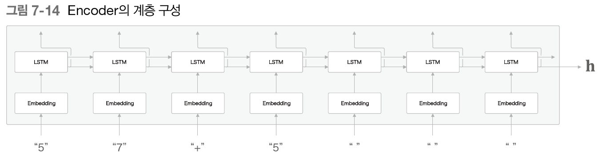

# 밑시딥2 📂7. RNN을 사용한 문장 생성

이번 장에서는 언어모델을 사용하여 문장 생성을 수행할 것이다.

말뭉치를 사용해 학습한 언어 모델을 이용하여 새로운 문장을 만들어낸다. 

그 다음 개선된 언어 모델을 이용하여 더 자연스러운 문장을 생선한다.

마지막으로는 seq2seq라는 새로운 신경망을 구현해보자.


## 1. 언어 모델을 사용한 문장 생성

1절에서는 언어 모델로 문장을 생성해보자.


### 1.1 RNN을 사용한 문장 생성의 순서

언어 모델에서 문장을 생성시키는 순서를 알아보자. 

'you say goodbye and i say hello'라는 말뭉치를 학습한 언어 모델에 'i'라는 단어를 입력하면 

다음과같은 확률분포를 출력한다.

 

다음 단어 생성 방법

- 결정적 방법 : 확률이 가장 높은 단어 선택
- 확률적 방법 : 확률이 높은 단어는 선택되기 쉽도록 선택

이렇게 선택을 반복하면 새로운 문장을 생성할 수 있다. 


### 1.2 문장 생성 구현

- 문장생성 메서드

```python
def generate(self, start_id, skip_ids=None, sample_size=100):
    '''
    start_id : 최초로 주는 단어의 id
    sample_size : 샘플링하는 단어의 수
    skip_ids : 단어 id의 리스트인데 이 리스트에 속하는 단어 id는 샘플링되지 않도록 한다.
    => 전처리된 단어를 샘플링하지 않도록 해줌
    '''
    word_ids = [start_id]

    x = start_id
    while len(word_ids) < sample_size:
        x = np.array(x).reshape(1, 1)
        # 각 단어의 점수 출력
        score = self.predict(x)
        # 점수를 소프트맥스로 정규화
        p = softmax(score.flatten())
		# 샘플링
        sampled = np.random.choice(len(p), size=1, p=p)
        if (skip_ids is None) or (sampled not in skip_ids):
            x = sampled
            word_ids.append(int(x))

    return word_ids
```

학습하지 않는 가중치  : you s.a. years speculative hart-scott-rodino porter mass-market owning ...

학습한 가중치 : you mean buying. that 's less assuming said mr. jones. inflation-adjusted rates...

=> 학습한 가중치를 사용한 학습 코드가 더 자연스럽지만 일반적으로 문장이라고 할 수 없다.


### 1.3 더 좋은 문장으로

더 좋은 언어모델로 학습시킨 경우 아래와 같은 결과를 출력한다.

the meaning of life is in the midwest at home prices...

the meaning of life is happening...


---


## 2. seq2seq

이번 절에는 시계열 데이터를 다른 시계열 데이터로 변환하는 모델을 생각해보자.

여기서에서는 2개의 RNN을 사용하는 seq2seq를 사용한다.


### 2.1 seq2seq의 원리

seq2seq = Encoder-Decoder : 입력 데이터를 인코딩하고 인코딩된 데이터를 디코딩한다.

 

Encoder : 인코딩한 정보에는 번역에 필요한 정보 응축

Decoder : 응축된 인코딩 정보를 바탕으로 도착어 문장 생성


1️⃣ encoder


encoder 출력인 벡터 h는 고정 길이 벡터이다.

즉, 인코딩한다 = 임의 길이의 문장을 고정 길이 벡터로 변환하는 작업

2️⃣ decoder

 

LSTM 계층이 벡터 h를 받는다. <eos>는 문장 생성의 시작의 신호이다.


 


### 2.2 시계열 데이터 변환용 장난감 문제

장난감 문제(toy problem) : 머신러닝을 평가하고자 만든 간단한 문제

 

지금까지 단어 단위로 분할 했지만 이번 문제에서는 문자 단위로 분할해보자.


### 2.3 가변 길이 시계열 데이터

이번 장난감 문제는 샘플마다 데이터의 시간 방향 크기가 다르다. 즉 가별 길이 시계열 데이터를 다룬다.

때문에 학습 시 '미니배치' 처리를 위해서는 추가 코딩이 필요하다.

가장 단순한 방법이 '패딩(padding)'이다.

**`패딩(padding)`** : 의미 없는 데이터를 채워 모든 데이터의 길이를 균일하게 처리한다.

 

이번 문제에서는 입력의 숫자가 세자리 수로 정하고 출력 앞에는 _를 붙이기로 약속하자.

이렇게 모든 샘플 데이터의 길이를 통일한다.

존재하지 않던 패딩용 문자까지 seq2seq가 처리하게 되므로 seq2seq에 패딩 전용 처리를 추가해야한다.


### 2.4 덧셈 데이터셋

```python
(x_train, t_train), (x_test, t_test) = sequence.load_data('addition.txt', seed=1984)
# load_data : 텍스트 파일 읽어와서 문자 id로 변환하고 훈련 데이터와 테스트 데이터로 나눠 반환한다.
char_to_id, id_to_char = sequence.get_vocab()
# get_vocab : 문자와 문자id의 대응 관계를 담은 딕셔너리 반환

print(x_train.shape, t_train.shape)
print(x_test.shape, t_test.shape)
# (45000, 7) (45000, 5)
# (5000, 7) (5000, 5)

print(x_train[0])
print(t_train[0])
# [ 3  0  2  0  0 11  5]
# [ 6  0 11  7  5]

print(''.join([id_to_char[c] for c in x_train[0]]))
print(''.join([id_to_char[c] for c in t_train[0]]))
# 71+118
# _189
```


---


## 3. seq2seq 구현

seq2seq는 2개의 RNN을 연결한 신경망이다. 

즉, encoder클래스와 decoder클래스를 연결하는 seq2seq 클래스를 구현해야한다.


### 3.1 Encoder 클래스



- Embedding 계층 : 문자를 문자 벡터로 변환
- LSTM : 오른쪽으로는 은닉상태(h_t)와 셀(c-t)을 출력, 위쪽으로 출력 은닉 상태는 폐기된다.

```python
class Encoder:
    def __init__(self, vocab_size, wordvec_size, hidden_size):
        # vocab_size : 어휘 수(문자의 종류), wordvec_size : 문자 벡터의 차원 수
        V, D, H = vocab_size, wordvec_size, hidden_size
        rn = np.random.randn

        embed_W = (rn(V, D) / 100).astype('f')
        lstm_Wx = (rn(D, 4 * H) / np.sqrt(D)).astype('f')
        lstm_Wh = (rn(H, 4 * H) / np.sqrt(H)).astype('f')
        lstm_b = np.zeros(4 * H).astype('f')

        self.embed = TimeEmbedding(embed_W)
        self.lstm = TimeLSTM(lstm_Wx, lstm_Wh, lstm_b, stateful=False)

        self.params = self.embed.params + self.lstm.params
        self.grads = self.embed.grads + self.lstm.grads
        self.hs = None

    def forward(self, xs):
        xs = self.embed.forward(xs)
        hs = self.lstm.forward(xs)
        self.hs = hs
        return hs[:, -1, :]

    def backward(self, dh):
        dhs = np.zeros_like(self.hs)
        dhs[:, -1, :] = dh

        dout = self.lstm.backward(dhs)
        dout = self.embed.backward(dout)
        return dout

```


### 3.2 Decoder 클래스

계산방식에서는 결정적인 답을 생성하고자 하므로 확률이 가장 높은 문자 하나만 고른다.


```python
class Decoder:
    def __init__(self, vocab_size, wordvec_size, hidden_size):
        V, D, H = vocab_size, wordvec_size, hidden_size
        rn = np.random.randn

        embed_W = (rn(V, D) / 100).astype('f')
        lstm_Wx = (rn(D, 4 * H) / np.sqrt(D)).astype('f')
        lstm_Wh = (rn(H, 4 * H) / np.sqrt(H)).astype('f')
        lstm_b = np.zeros(4 * H).astype('f')
        affine_W = (rn(H, V) / np.sqrt(H)).astype('f')
        affine_b = np.zeros(V).astype('f')

        self.embed = TimeEmbedding(embed_W)
        self.lstm = TimeLSTM(lstm_Wx, lstm_Wh, lstm_b, stateful=True)
        self.affine = TimeAffine(affine_W, affine_b)

        self.params, self.grads = [], []
        for layer in (self.embed, self.lstm, self.affine):
            self.params += layer.params
            self.grads += layer.grads

    def forward(self, xs, h):
        self.lstm.set_state(h)

        out = self.embed.forward(xs)
        out = self.lstm.forward(out)
        score = self.affine.forward(out)
        return score

    def backward(self, dscore):
        dout = self.affine.backward(dscore)
        dout = self.lstm.backward(dout)
        dout = self.embed.backward(dout)
        dh = self.lstm.dh
        return dh

    # 학습 시와 문장 생성 시의 동작이 다르다.
    def generate(self, h, start_id, sample_size):
        sampled = []
        sample_id = start_id
        self.lstm.set_state(h)

        for _ in range(sample_size):
            x = np.array(sample_id).reshape((1, 1))
            out = self.embed.forward(x)
            out = self.lstm.forward(out)
            score = self.affine.forward(out)

            sample_id = np.argmax(score.flatten())
            sampled.append(int(sample_id))

        return sampled
```


### 3.3 seq2seq 클래스

```python
class Seq2seq(BaseModel):
    def __init__(self, vocab_size, wordvec_size, hidden_size):
        V, D, H = vocab_size, wordvec_size, hidden_size
        self.encoder = Encoder(V, D, H)
        self.decoder = Decoder(V, D, H)
        self.softmax = TimeSoftmaxWithLoss()

        self.params = self.encoder.params + self.decoder.params
        self.grads = self.encoder.grads + self.decoder.grads

    def forward(self, xs, ts):
        decoder_xs, decoder_ts = ts[:, :-1], ts[:, 1:]

        h = self.encoder.forward(xs)
        score = self.decoder.forward(decoder_xs, h)
        loss = self.softmax.forward(score, decoder_ts)
        return loss

    def backward(self, dout=1):
        dout = self.softmax.backward(dout)
        dh = self.decoder.backward(dout)
        dout = self.encoder.backward(dh)
        return dout

    def generate(self, xs, start_id, sample_size):
        h = self.encoder.forward(xs)
        sampled = self.decoder.generate(h, start_id, sample_size)
        return sampled
```


### 3.4 seq2seq 평가

에폭을 거듭할수록 정답률은 높아진다. 하지만 정답률은 매우 낮기때문에 seq2seq를 개선시켜보자.


---


## 4. seq2seq 개선

속도 개선

- 입력 데이터 반전(reverse)
- 엿보기(peeky)


### 4.1 입력 데이터 반전(Reverse)


입력 데이터를 반전시키면 학습진행이 빨라지고 최종 정확도 또한 좋아진다고 한다.

- 파이썬 구현

```python
# 입력 반전 여부 설정 =============================================
is_reverse = False  # True
if is_reverse:
    x_train, x_test = x_train[:, ::-1], x_test[:, ::-1]
# ================================================================
```

🙄 직관적으로 기울기 전파가 원활해지기 때문이라고 예상.

👉 입력 문장의 첫 부분이 반전 때문에 변환 후 단어와 가까워져 기울기가 더 잘 전해진다고 생각


### 4.2 엿보기(Peeky)


h 안에는 decoder에게 필요한 정보 모두 담겨 있다. 때문에 이 중요한 정보인 h를 더 활용할 방법을 찾는다.


Affine 계층과 LSTM 계층에 출력 h를 전해주면서 입력 벡터가 2개씩 된다.

이는 실제로 두 벡터가 연결된 것을 의미한다.

 

```python
class PeekyDecoder:
    def __init__(self, vocab_size, wordvec_size, hidden_size):
        V, D, H = vocab_size, wordvec_size, hidden_size
        rn = np.random.randn

        embed_W = (rn(V, D) / 100).astype('f')
        # 가중치 형상 커짐
        lstm_Wx = (rn(H + D, 4 * H) / np.sqrt(H + D)).astype('f')
        lstm_Wh = (rn(H, 4 * H) / np.sqrt(H)).astype('f')
        lstm_b = np.zeros(4 * H).astype('f')
        affine_W = (rn(H + H, V) / np.sqrt(H + H)).astype('f')
        affine_b = np.zeros(V).astype('f')

        self.embed = TimeEmbedding(embed_W)
        self.lstm = TimeLSTM(lstm_Wx, lstm_Wh, lstm_b, stateful=True)
        self.affine = TimeAffine(affine_W, affine_b)

        self.params, self.grads = [], []
        for layer in (self.embed, self.lstm, self.affine):
            self.params += layer.params
            self.grads += layer.grads
        self.cache = None

    def forward(self, xs, h):
        N, T = xs.shape
        N, H = h.shape

        self.lstm.set_state(h)

        out = self.embed.forward(xs)
        # 시계열만큼 복제해 hs에 저장
        hs = np.repeat(h, T, axis=0).reshape(N, T, H)
        # hs와 embedding 계층의 출력 연결
        out = np.concatenate((hs, out), axis=2)

        out = self.lstm.forward(out)
        # 이를 LSTM 계층에 연결
        out = np.concatenate((hs, out), axis=2)

        score = self.affine.forward(out)
        self.cache = H
        return score
```

 

현재까지 수행한 개선보다 더 큰 효과를 가져올 수 있는 어텐션 기술은 다음 장에서 배운다.


---


## 5. seq2seq를 이용하는 애플리케이션

- 기계 번역 : 다른 언어의 문장으로 변환
- 자동 요약 : 짧게 요약된 문장으로 변환
- 질의응답 : 응답으로 변환
- 메일 자동 응답 : 답변 글로 변환


### 5.1 챗봇

### 5.2 알고리즘 학습

소스 코드도 시계열 데이터이므로 코딩 학습이 가능하다.


### 5.3 이미지 캡셔닝

seq2seq는 텍스트 외에도 이미지, 음성 등 다양한 데이터를 처리할 수 있다.


CNN의 최종 출력은 특징 맵이다. 즉, 3차원이므로 이를 Decoder의 LSTM이 처리할 수 있도록 전처리해야한다.

특징 맵을 1차원으로 평탄화한 후 입력시킨다.

